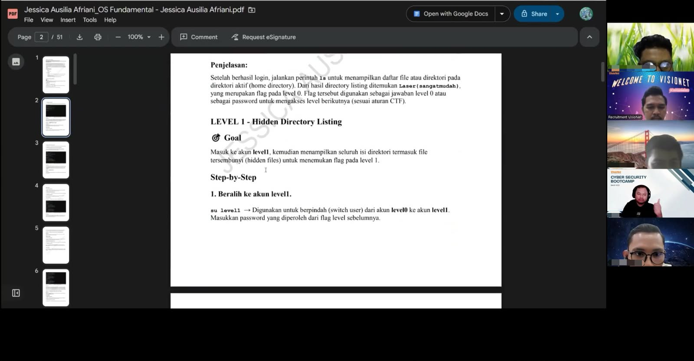

# Cyber Security Portfolio

Halo, saya Jessica Ausilia, lulusan S1 Sistem Informasi yang saat ini sedang mengembangkan kemampuan di bidang Cyber Security melalui **Cyber Security Bootcamp di Visionet Data Internasional**.

Repository ini berisi dokumentasi dari beberapa praktik lab yang saya kerjakan selama proses pembelajaran. Portfolio ini dibuat sebagai bentuk dokumentasi hands-on practice untuk memahami dasar keamanan sistem, aplikasi web, serta jaringan.

## Fokus Pembelajaran

Dalam proses pembelajaran, saya berfokus pada beberapa fundamental yang mendukung pemahaman di bidang **Security Operations (SOC)**, yaitu:

* **Linux Fundamental** — memahami dasar sistem operasi Linux, penggunaan command line, user dan permission, serta penggunaan Linux untuk mendukung proses analisis keamanan.
* **Common Web Vulnerabilities** — mempelajari konsep dan praktik beberapa kerentanan umum pada aplikasi web melalui controlled lab environment.
* **Network Security & Traffic Analysis** — mempelajari dasar keamanan jaringan serta melakukan analisis network traffic untuk memahami pola komunikasi dan mengidentifikasi aktivitas yang mencurigakan.

## Tools yang Digunakan

* Kali Linux
* Wireshark
* Burp Suite
* OWASP ZAP

## Hands-on Practice

### 01. Linux Fundamental

Praktik dasar Linux yang mencakup penggunaan command line, navigasi file dan direktori, user dan permission, serta penggunaan beberapa command untuk mendukung proses troubleshooting dan analisis keamanan.

### 02. Common Web Vulnerabilities

Praktik pada controlled lab environment untuk memahami beberapa kerentanan umum pada aplikasi web, cara kerentanan tersebut dapat terjadi, serta bagaimana aktivitasnya dapat diamati dan dianalisis.

### 03. Network Security & Traffic Analysis

Praktik untuk memahami dasar keamanan jaringan dan menganalisis network traffic menggunakan Wireshark dan Tshark. Analisis dilakukan dengan mengamati komunikasi jaringan, protokol, source dan destination, serta pola traffic yang berpotensi mencurigakan.

## Tujuan Portfolio

Portfolio ini dibuat untuk mendokumentasikan proses pembelajaran dan meningkatkan kemampuan praktis di bidang Cyber Security, khususnya sebagai dasar untuk berkembang di bidang **Security Operations / SOC**.

Saya masih berada dalam tahap pembelajaran dan terus mengembangkan kemampuan melalui praktik, analisis, dan pembelajaran secara berkelanjutan.

## Status

**Cyber Security Bootcamp — Ongoing**

## Disclaimer

Seluruh praktik keamanan yang didokumentasikan dalam repository ini dilakukan pada **authorized training environment atau controlled lab environment** untuk tujuan pembelajaran.

Tidak ada pengujian yang dilakukan terhadap sistem atau jaringan tanpa izin.

## Dokumentasi

Dokumentasi berikut merupakan bagian dari proses pembelajaran selama mengikuti Cyber Security Bootcamp di Visionet Data Internasional.

**Zoom Learning Session**

